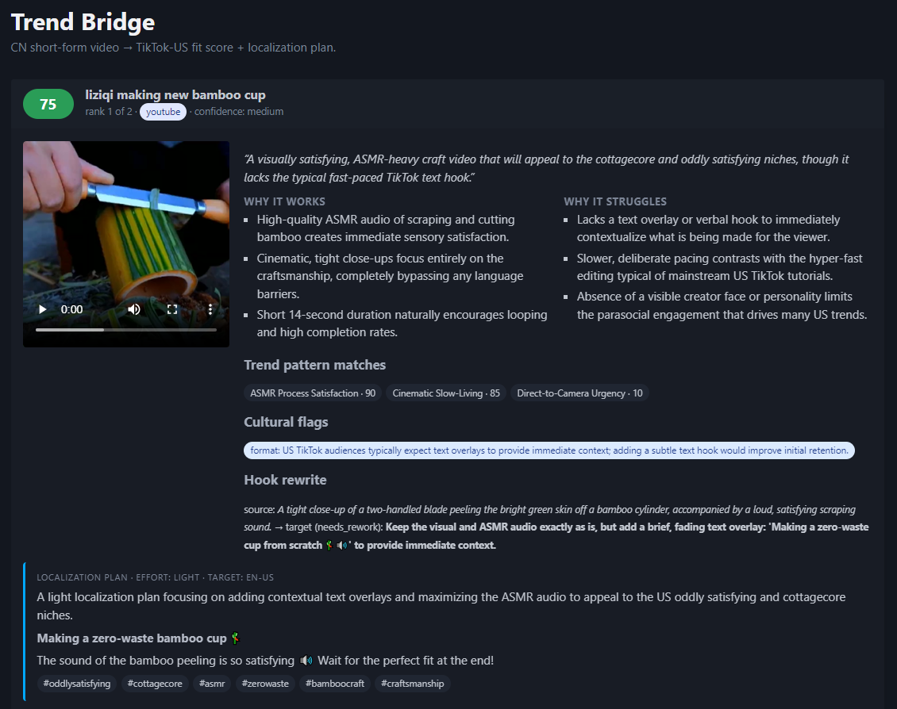
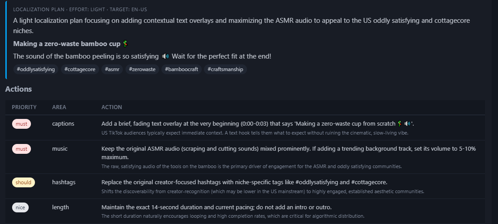

# Trend Bridge

> **Drop in any video. Get a viral fit score, a localization plan, and publish cross-border — in 2 minutes.**

[View Full Pitch Deck →](./pitch.html)

## UI Screenshots




---

## What We Build

An AI pipeline that predicts how well any short-form video will resonate in a new market — and gives creators a concrete localization playbook to get there.

**Input:** A video from Douyin / Bilibili / Xiaohongshu  
**Output:** Fit score + localization plan + AI-dubbed video + one-click publish

---

## The Problem

| | |
|---|---|
| **No Signal** | Creators guess whether their video will work in a new market. There's no data. |
| **Cultural Blind Spots** | Language is 20% of the problem. Pacing, hooks, music — none of it gets addressed. |
| **Siloed Markets** | Trend data from each platform lives separately. No tool maps across regions. |

---

## The Gap

Most top Chinese creators have massive domestic audiences but almost no global reach:

| Creator | Bilibili | YouTube | Transfer Rate |
|---|---|---|---|
| 李子柒 (Li Ziqi) | ~20M | ~20M | **~100%** ★ |
| 影视飓风 | 14.76M | 849K | 5.8% |
| 老番茄 | 19.92M | 192K | 1.0% |
| 木鱼水心 | 14.39M | 50.5K | 0.4% |

Li Ziqi crossed over because her content is visually universal. Every other creator is leaving **10× revenue** on the table — just because of the language and cultural barrier.

---

## How It Works

```
Source Video + Metadata
        │
        ▼
┌──────────────────┐     ┌──────────────────────┐
│  Trend Corpus    │────▶│   Scorer  (Call #1)  │
│  us_tiktok.json  │     │   Gemini Multimodal  │
│  12 trending vids│     │   → ScoringReport    │
└──────────────────┘     │   fit_score: 78/100  │
                         └──────────┬───────────┘
                                    │
                                    ▼
                         ┌──────────────────────┐
                         │  Localizer (Call #2) │
                         │  Gemini Multimodal   │
                         │  → LocalizationPlan  │
                         │  → AI dubbed video   │
                         └──────────┬───────────┘
                                    │
                                    ▼
                         ┌──────────────────────┐
                         │  One-Click Publish   │
                         │  Title · Caption     │
                         │  Hashtags · Video    │
                         └──────────────────────┘
```

**Two Gemini calls per video. That's it.**

---

## Output Example

**Scoring Report**
- Fit score: `78 / 100`
- Verdict: *"Strong POV format alignment with TikTok-US fitness content wave. Hook needs English-register rework."*
- Cultural flags: music IP conflict risk in US market

**Localization Plan**

| Priority | Area | Action |
|---|---|---|
| MUST | Music | Replace with royalty-free trending audio |
| MUST | Captions | Add EN-US captions, rewrite hook line |
| SHOULD | Length | Trim from 58s to 30s |
| SHOULD | Hashtags | #gymtok #fitcheck #gains |

**Estimated effort: LIGHT**

---

## Who We Serve

- **Solo Creators** — 100k+ followers on Douyin / XHS / Bilibili wanting global reach without an agency
- **MCN Agencies** ★ — Managing 50–500 creators, screening entire catalogs for cross-border potential
- **Brand Studios** — Global brands validating cultural fit before spending on paid distribution

---

## Revenue Opportunity

For a creator like 影视飓风 (14.76M Bilibili followers):

| | Without Trend Bridge | With Trend Bridge |
|---|---|---|
| YouTube subs | 849K (5.8% transfer) | 4.4M (30% transfer) |
| Est. revenue/yr | ~$80K | ~$900K |
| **Uplift** | | **+$820K / yr (10×)** |

*30% transfer rate · $3 YouTube RPM · 500K views/video · 2 videos/week*

---

## Setup

```bash
python -m venv .venv
source .venv/bin/activate
pip install -e .
pip install -r requirements.txt
```

## Run

```bash
# Score a single video
python -m trend_bridge score --source video.mp4 --metadata video.json --target us-tiktok

# Full demo — 3 bundled source videos, sorted by fit score
python -m trend_bridge demo
```

## Mock Mode (no API billing)

```bash
TB_MOCK=replay pytest
TB_MOCK=record python -m trend_bridge demo
```

---

## Stack

| Layer | Tech |
|---|---|
| AI Analysis | Google Gemini (multimodal structured output) |
| Video Generation | BytePlus Seedance (P1) |
| Pipeline | Python · Pydantic |
| Testing | pytest + TB_MOCK=replay |

---

*Beta University Multi-modal Hackathon · April 18, 2026*
